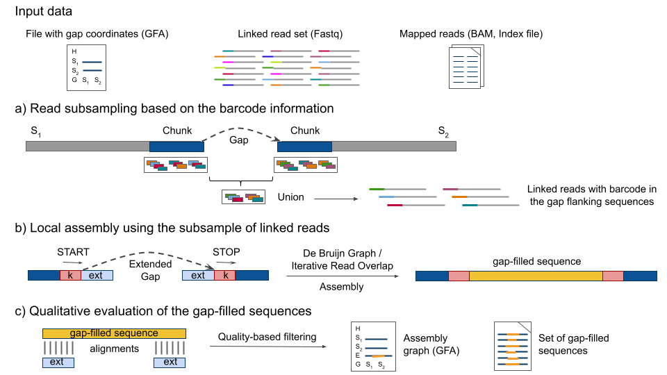

# MTG-Link

[](https://anaconda.org/bioconda/mtglink)  
[](http://www.gnu.org/licenses/agpl-3.0.en.html)


## What is MTG-Link ?

MTG-Link is a novel **gap-filling** tool for draft genome assemblies, dedicated to **linked read** data.  
The main feature of MTG-Link is that it takes advantage of the linked-read barcode information to get a **subsample of reads** of interest for the **local assembly** of each gap. It also automatically tests different parameters values and performs a **qualitative evaluation** of the obtained solutions.

It takes as input a set of linked reads, a GFA file with gap coordinates and an indexed BAM file obtained after mapping the linked reads onto the draft assembly. It outputs the set of gap-filled sequences in FASTA format, as well as an assembly graph file in GFA format, containing the original contigs and the obtained gap-filled sequences of each gap, together with their overlapping relationships.

Presently, it is directly compatible with the following linked-reads technologies, given the barcodes are reported using the BX:Z tag:
* 10X Genomics
* Haplotagging
* stLFR
* TELL-Seq

**MTG-Link** is a [Inria Genscale](https://team.inria.fr/genscale/) and [INRAE](https://www.inrae.fr/) tool developed by Anne Guichard.


## Installation

### External dependencies

* Biopython
* Pathos
* Regex
* Gfapy
* Samtools
* Mummer
* Blast
* LRez
* MindTheGap

You can install them via the conda package manager:  
`conda install -c bioconda samtools gfapy blast regex`  
`conda install -c conda-forge biopython pathos`   
`conda install -c bioconda/label/cf201901 mummer`     
`conda install -c bioconda lrez`  
`conda install -c bioconda mindthegap`  

Alternatively, you can install them via the requirements.txt file.  
To install a list of packages into a specified conda environment, do the following:  
`conda create --name <env> --file requirements.txt`

For more information on the LRez and MindTheGap tools:
* LRez: <https://github.com/morispi/LRez>
* MindTheGap: <https://github.com/GATB/MindTheGap>


### Getting the latest source code with git

```
# Get a local copy of MTG-Link source code
git clone --recursive https://github.com/anne-gcd/MTG-Link.git
```


### Using conda

MTG-link is also distributed as a [Bioconda package](https://anaconda.org/bioconda/mtglink):
```
conda install -c bioconda mtglink
```


### Testing the installation

You can test your installation of MTG-Link using the small dataset in the `test/` directory.  
As MTG-Link has **two local assembly modules (DBG and IRO)**, it is better to test these two modules.

#### Module DBG
```
# If mtglink.py is in your PATH 
cd test/
mtglink.py DBG -gfa test.gfa -bam test.bam -fastq reads.sorted.fastq -index barcoded.shelve -out results_MTGLink_DBG
```
The installation is successful if you find a file named `test_mtglink.gfa` in the output directory (`results_MTGLink_DBG/`), and it should contain 4 S-lines (2 for both flanking contigs sequences, and 2 for both gap-filled sequences) and 4 E-lines.  
The set of gap-filled sequences (`test.gfa.gapfill_seq.fasta`) should contain 2 gap-filled sequences (one forward and one reverse, both of length 2000 bp).

#### Module IRO
```
# If mtglink.py is in your PATH 
cd test/
mtglink.py IRO -gfa test.gfa -bam test.bam -fastq reads.sorted.fastq -index barcoded.shelve -out results_MTGLink_IRO
```
The installation is successful if you find a file named `test_mtglink.gfa` in the output directory (`results_MTGLink_IRO/`), and it should contain 3 S-lines (2 for both flanking contigs sequences, and 1 for the gap-filled sequence) and 2 E-lines.  
The set of gap-filled sequences (`test.gfa.gapfill_seq.fasta`) should contain 1 gap-filled sequence (one forward of length 2000 bp).


## User Manual

### Description

For each gap, MTG-Link relies on a **three-step pipeline** to gap-fill the gap.  
The first step uses the barcode information of the linked read dataset to
get a **subsample of reads** of potential interest for gap-filling.  
The second step performs **local assembly** using this subsample of linked reads. Two different assembly algorithms are implemented and can be interchangeably used. The first one, called hereafter the **De Bruijn Graph (DBG) algorithm**, uses a de Bruijn graph data structure, and the second one, called the **Iterative Read Overlap (IRO) algorithm**, is based on on-the-fly computations of read overlaps.  
The third step evaluates the obtained gap-filled sequence and annotates it with a **quality score**.  
In order to speed up the process, MTG-Link uses a trivial **parallelization** scheme by giving each gap to a separate thread.   



#### a) Read subsampling

For each gap, MTG-Link extracts the linked reads whose barcode is observed in the chunk regions surrounding the gap, using the thirdparty tool **LRez**.  
The chunk region size can be defined by the user, the default value being 5,000 bp.  
To increase specificity, we keep only the barcodes for which the number of occurrences in the union set from the two flanking sequences is larger than a user-defined parameter -f (by default 2).  

The linked reads extracted during this step constitute the read subsample used in the local assembly step.


#### b) Local assembly

To fill the gap between two contigs, a local assembly is performed using the subsample of linked reads obtained during the "Read subsampling" step.  
To be able to further evaluate the obtained gap-filled sequence, we extend the gap on both sides by `-ext` bp (by default 500 bp). Thus, MTG-Link will perform the local assembly between the sequences surrounding the extended gap, e.g. from the k-mer START (source) to the k-mer STOP (target).   
Two assembly algorithms can be used during this step: the **DBG algorithm** or the **IRO algorithm**.

##### Module DBG

The DBG algorithm is performed with the *fill* module of the software **MindTheGap**. The *fill* module of MindTheGap is an efficient local assembly module that relies on a **De Bruijn graph** data structure to represent the input read sequences. MindTheGap will try to find a path in the de Bruijn graph from the k-mer START (source) to the k-mer STOP (target). The gap-filling is performed in both forward and reverse orientation.  
In this module, two parameters have major impacts on the quality of the assembly: the **k-mer size** (**`-k`**) and the **k-mer abundance threshold** (**`-a`**) for including a k-mer in the graph (solid k-mer threshold). These parameters are
usually set in accordance with the expected sequencing depth. In the case of MTG-link, the latter may vary depending on the efficiency of the barcode-based subsampling step. Hence for higher sensitivity, MTG-Link automatically tests different values for these two parameters, starting with the highest ones and decreasing the values if no inserted sequence with good quality is found.

##### Module IRO

The IRO algorithm is based on **on-the-fly computations of read overlaps and iterative extensions** of the current assembly sequence. Overlapping reads are reads whose prefix (or reverse complement of the suffix) aligns with the suffix of the current assembly sequence with at most **`-dmax`** differences (including
substitutions and indels) over at least **`-o`** bp. These overlaps are found using a **seed-and-extend** schema, combining a **seed indexing** with a hash table and a **banded dynamic programming semi-global alignment algorithm**. At each iteration, several possible extensions may be found, due to sequencing
errors and/or repeats. To avoid including sequencing errors, only extensions that are supported by a minimum number of reads (parameter **`-a`**, by default 2) are considered. Then, another extension phase begins.  
When no overlapping read is found, or if there is no extension shared by a sufficient number of reads, or if the maximal assembled sequence size (user
defined parameter) is reached, then the algorithm **backtracks** and tries other extensions previously encountered but not yet explored. Finally, if during an extension phase, the k-mer STOP is found, the assembly sequence is returned and the exploration ends.


#### c) Qualitative evaluation

MTG-Link assigns a **quality score** to each gap-filled sequence obtained during the "Local assembly" step, that might help filtering out putative erroneous sequences:
* If a **reference sequence** is provided (**`-refDir`**):  1-letter score X<sub>1</sub> with X = [A, B, C, D]
    * X<sub>1</sub>: alignment to the entire reference sequence
* Using the **gap flanking contigs** information (**`-ext`**): 2-letters score X<sub>1</sub>X<sub>2</sub> with X = [A, B, C, D]
    * X<sub>1</sub>: alignment to the left flanking sequence (left 'ext' sequence)
    * X<sub>2</sub>: alignment to the right flanking sequence (right 'ext' sequence )

MTG-Link selects the gap-filled sequences with a score **[AB]** (reference sequence provided) or with a score **[AB]{2}** (using the flanking contigs information).  
To have a good quality score, when comparing to the flanking contigs, the gap-filled sequence must be larger than twice `-ext` bp, and it must align on at least 90% of the lengths of the gap flanking sequences.  
To have a good quality score, when comparing to the flanking contigs, the length of the gap-filled sequence must be +-10% of the reference length, and it must align on at least 90% of the reference length.


#### Output

MTG-Link returns the results in a **GFA** file (GFA 2.0), containing the original contigs and the obtained gap-filled sequences of each gap, together with their overlapping relationships. It also returns the set of gap-filled sequences in a **FASTA** file. 


### Preparing input files

#### 1. GFA file

The **GFA** (Graphical Fragment Assembly) file is a *tab-delimited* file containing the gap coordinates. The expected format is a [GFA 2.0](http://gfa-spec.github.io/GFA-spec/GFA2.html) format:  
```
<header>   <- H {VN:Z:2.0}
<segment>  <- S <sid> <slen_in_bp> * UR:Z:<path_to_fasta_sequence>
<gap>      <- G (* | <gid>) <sid1(+|-)> <sid2(+|-)> <dist> (* | <var>)
```
The **G-lines** describe a gap edge, that gives the estimated gap distance between the two segment sequences and the variance of that estimate.  
The gap is between the first segment at left `<sid1(+|-)>` and the second segment at right `<sid2(+|-)>` where the segments are oriented according to their sign indicators `(+|-)`.  
The `<dist>` field gives the expected distance between the first and second segment in their respective orientations, or 0 is this expected distance is unknown.  

Example:
```
H	VN:Z:2.0
S	8-L	3152098	*	UR:Z:8.1000.5000.left.fasta
S	8-R	3152097	*	UR:Z:8.1000.5000.right.fasta
G	*	8-L+	8-R+	1000	*
```
The **FASTA** files containing the segment sequences (indicating after `UR:Z:` in the GFA file) should have record ID that contains the ID of the corresponding segment (`<sid>`). 

Example:
```
grep '>' 8.1000.5000.left.fasta
>>> >8-L_1000_5000_len_3152098
```

How to obtain a GFA file:
* If you have a file containing the paths between scaffolds, you can use the **paths2gfa.py** script (in the `utils/` directory).  
  format of a path: `<int:nb_scaffolds>****<sid1(f|r)>+<sid2(f|r)>`
* If you have a FASTA file with sequences containing 'Ns' regions (where 'Ns' regions will be treated as gaps), you can use the **fasta2gfa.py** script (in the `utils/` directory).
* If you have a file containing the links between the ends of the scaffolds in tabular format (e.g. a matrix), you can use the **matrix2gfa.py** script (in the `utils/` directory).


#### 2. BAM file

The **BAM** file is a *Samtools* indexed bam file, obtained after mapping the linked reads onto the assembly.  
For example, the *longranger* pipeline outputs an indexed BAM file containing position-sorted, aligned reads. Each read in this BAM file has Chromium barcode and phasing information attached. 


#### 3. FASTQ file

The **FASTQ** file is a barcoded Fastq file from linked reads obtained with *longranger basic*.


#### 4. Index file

The **index** file contains the index of barcodes.  
To get the index file, you need to use the subcommand `index fastq` of the tool [LRez](https://github.com/morispi/LRez):
```
LRez index fastq --fastq <reads.fastq.gz> --output <barcoded.shelve> --gzip
```
With `<barcoded.shelve>` being the output indexed file.


### Usage

MTG-Link takes as input a GFA file (GFA 2.0) with gap coordinates, a set of linked reads, an indexed BAM file obtained after mapping the linked reads onto the draft assembly and an indexed FASTQ file.  
It outputs the results in a GFA file (GFA 2.0), containing the original contigs and the obtained gap-filled sequences of each gap, together with their overlapping relationships. It also returns the set of gap-filled sequences in a FASTA file. 

The qualitative evaluation of MTG-Link can be performed either with the corresponding reference sequences of the gaps (`-refDir`) or with the flanking contigs sequences.

The MTG-Link command line interface is composed of multiple parameters:
```
./mtglink.py --help

>>> usage: mtglink.py [-h] [-v] {DBG,IRO} ...

>>> Gapfilling with linked read data, using either a De Bruijn Graph (DBG) algorithm or an Iterative Read Overlap (IRO) algorithm

>>> positional arguments:
      {DBG,IRO}   MTGLink_module used for the Local Assembly step
        DBG       Gap-filling using a De Bruijn Graph (DBG) algorithm
        IRO       Gap-filling using an Iterative Read Overlap (IRO) algorithm

>>> optional arguments:
      -h, --help  show this help message and exit
      -v          show program's version number and exit
```
The parameters for the **DBG module** of MTG-Link are obtained with:
```
./mtglink.py DBG -h

>>> usage: mtglink.py DBG [-h] -gfa GFA [-c CHUNK] -bam BAM -fastq READS -index INDEX [-f FREQ] [-out OUTDIR] [-refDir REFDIR] [-line LINE] [-rbxu RBXU] [-ext EXTENSION] [-l MAX_LENGTH] [-k KMER_SIZE [KMER_SIZE ...]] 
                          [-a ABUNDANCE_THRESHOLD [ABUNDANCE_THRESHOLD ...]] [--force] [-max-nodes MAX_NODES] [-nb-cores NB_CORES] [-max-memory MAX_MEMORY] [-verbose VERBOSITY]

>>> optional arguments:
      -h, --help            show this help message and exit
      -gfa GFA              Input GFA file (GFA 2.0) (format: xxx.gfa)
      -c CHUNK              Chunk size (bp) [default: 5000]
      -bam BAM              BAM file: linked reads mapped on current genome assembly (format: xxx.bam)
      -fastq READS          File of indexed reads (format: xxx.fastq | xxx.fq)
      -index INDEX          Barcodes index file (format: xxx.shelve)
      -f FREQ               Minimal frequence of barcodes observed in the union set from the two flanking gap sequences [default: 2]
      -out OUTDIR           Output directory [default: ./mtglink_results]
      -refDir REFDIR        Directory containing the reference sequences if any [optional]
      -line LINE            Line of GFA file input from which to start analysis (if not provided, start analysis from first line of GFA file input) [optional]
      -rbxu RBXU            File containing the reads of the union of the corresponding gap (if already extracted) [optional]
      -ext EXTENSION        Size of the extension of the gap on both sides (bp); determine start/end of gapfilling [default: 500]
      -l MAX_LENGTH         Maximum assembly length (bp) (it could be a bit bigger than the length of the gap to fill OR it could be a very high length to prevent for searching indefinitely [default: 10000]
      -k KMER_SIZE [KMER_SIZE ...]
                            k-mer size(s) used for gap-filling [default: [51, 41, 31, 21]]
      -a ABUNDANCE_THRESHOLD [ABUNDANCE_THRESHOLD ...]
                            Minimal abundance threshold for solid k-mers [default: [3, 2]]
      --force               To force search on all '-k' values provided
      -max-nodes MAX_NODES  Maximum number of nodes in contig graph [default: 1000]
      -nb-cores NB_CORES    Number of cores for DBG assembly [default: 1]
      -max-memory MAX_MEMORY
                            Maximum memory for graph building (in MBytes) [default: 0]
      -verbose VERBOSITY    Verbosity level for DBG assembly [default: 0]
```
The parameters for the **IRO module** of MTG-Link are obtained with:
```
./mtglink.py IRO -h

>>> usage: mtglink.py IRO [-h] -gfa GFA [-c CHUNK] -bam BAM -fastq READS -index INDEX [-f FREQ] [-out OUTDIR] [-refDir REFDIR] [-line LINE] [-rbxu RBXU] [-ext EXTENSION] [-l MAX_LENGTH] [-s SEED_SIZE] [-o MIN_OVERLAP] 
                          [-a ABUNDANCE_MIN [ABUNDANCE_MIN ...]] [-dmax MAX_SCORE]

>>> optional arguments:
      -h, --help            show this help message and exit
      -gfa GFA              Input GFA file (GFA 2.0) (format: xxx.gfa)
      -c CHUNK              Chunk size (bp) [default: 5000]
      -bam BAM              BAM file: linked reads mapped on current genome assembly (format: xxx.bam)
      -fastq READS          File of indexed reads (format: xxx.fastq | xxx.fq)
      -index INDEX          Barcodes index file (format: xxx.shelve)
      -f FREQ               Minimal frequence of barcodes observed in the union set from the two flanking gap sequences [default: 2]
      -out OUTDIR           Output directory [default: ./mtglink_results]
      -refDir REFDIR        Directory containing the reference sequences if any [optional]
      -line LINE            Line of GFA file input from which to start analysis (if not provided, start analysis from first line of GFA file input) [optional]
      -rbxu RBXU            File containing the reads of the union of the corresponding gap (if already extracted) [optional]
      -ext EXTENSION        Size of the extension of the gap on both sides (bp); determine start/end of gapfilling [default: 500]
      -l MAX_LENGTH         Maximum assembly length (bp) (it could be a bit bigger than the length of the gap to fill OR it could be a very high length to prevent for searching indefinitely [default: 10000]
      -s SEED_SIZE          Seed size used for indexing the reads (bp) [default: 10]
      -o MIN_OVERLAP        Minimum overlapping size (bp) [default: 20]
      -a ABUNDANCE_MIN [ABUNDANCE_MIN ...]
                            Minimal abundance(s) of reads used for gapfilling ; extension's groups having less than this number of reads are discarded from the graph [default: [3, 2]]
      -dmax MAX_SCORE       Maximum number of gaps/substitutions allowed in the inexact overlap between reads [default: 2]
```


### Output files

Using MTG-Link on the small dataset of the `test/` directory, you will get:
* a log file (`.union.sum`), a tabular file with some information on the number of barcodes and reads extracted for each gap.
* an assembly graph file (`_mtglink.gfa`) in GFA format. It contains the original contigs and the obtained gap-filled sequences of each gap, together with their overlapping relationships. 
* a sequence file (`.gapfill_seq.fasta`) in FASTA format. It contains the set of gap-filled sequences.

There is also a `read_subsampling/` directory, with:
* a barcodes file (`.bxu`), containing the barcodes observed in the gap flanking sequences.
* a reads file (`.rbxu.fastq`) in FASTQ format. It contains the linked reads whose barcode is observed in the gap flanking sequences.

There is also a `contigs/` directory, with:
* a sequence file (`.contigs.fasta`) in FASTA format. It contains the gap flanking sequences.

There is also a `local_assembly/` directory, with:
* For the **DBG module**:
    * a breakpoint file (`.bkpt.fasta`) in FASTA format. It contains the breakpoint sequences (e.g the start and stop k-mers) used for gap-filling.
    * a log file (`.info.txt`), a tabular file with some information about the filling process for each breakpoint.
    * a sequence file (`.insertions_quality.fasta`) in FASTA format. It contains the inserted/gap-filled sequences that were successfully assembled, with their qualitative scores. 
* For the **IRO module**:
    * a breakpoint file (`.start_stop.fa`) in FASTA format. It contains the breakpoint sequences (e.g the start and stop k-mers) used for gap-filling.
    * a log file (`.iro.log`), a text file with extended (but not completed) sequences and some information on why the gap-filling was not completed for these sequences.
    * a sequence file (`.insertions_quality.fasta`) in FASTA format. It contains the inserted/gap-filled sequences that were successfully assembled, with their qualitative scores. 

And finally, there is also a `qual_evaluation/` directory, with: 
* a log file (`.ref_qry.log`), a text file with some information on the input files used for the alignment. 
* an alignment file (`.ref_qry.alignment.stats`), a tabular file with some information on the alignment performed between the gap-filled sequences and a reference sequence.


<!--
## License
Please note that GATB-Core is distributed under Affero-GPL license.
-->

## Contact

To contact a developer, request help, or for any feedback on MTG-Link, please use the issue form of github: https://github.com/anne-gcd/MTG-Link/issues

You can see all issues concerning MTG-Link [here](https://github.com/anne-gcd/MTG-Link/issues).

If you do not have any github account, you can also send an email to Anne Guichard (<anne.guichard@irisa.fr>).

