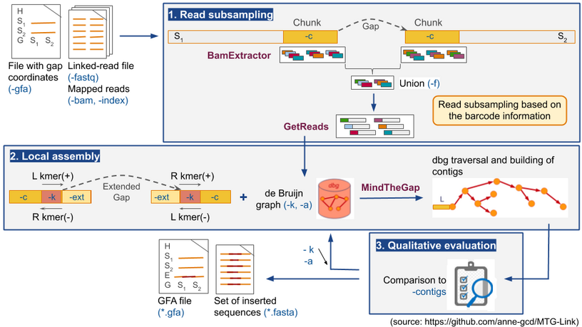

# MTG-Link

[](http://www.gnu.org/licenses/agpl-3.0.en.html)

## What is MTG-Link ?

MTG-Link is a novel **gap-filling** tool for draft genome assemblies, dedicated to **linked read** data.
It is a Python pipeline combining the local assembly tool **[MindTheGap](https://github.com/GATB/MindTheGap)** and an efficient read subsampling based on the barcode information.
It takes as input a set of reads, a GFA file and a BAM file. It outputs the results in a GFA file. 

Presently, it is directly compatible with the following linked-reads technologies, given the barcodes are reported using the BX:Z tag:
* 10X Genomics
* Haplotagging
* stLFR
* TELL-Seq

**MTG-Link** is a [Inria Genscale](https://team.inria.fr/genscale/) and [INRAE](https://www.inrae.fr/) tool developed by Anne Guichard.


## Installation

### External dependencies

* Biopython
* Pathos
* Gfapy
* Samtools
* Mummer
* Blast
* LRez
* MindTheGap

You can install them via the conda package manager:  
`conda install -c bioconda samtools gfapy blast`  
`conda install -c conda-forge biopython pathos`  
`conda install -c bioconda/label/cf201901 mummer`     
`conda install -c bioconda lrez`  
`conda install -c bioconda mindthegap`  

Alternatively, you can install them via the requirements.txt file.  
To install a list of packages into a specified conda environment, do the following:  
`conda create --name <env> --file requirements.txt`

For more information on the LRez and MindTheGap tools:
* LRez: <https://github.com/morispi/LRez>
* MindTheGap: <https://github.com/GATB/MindTheGap>


### Getting the latest source code with git

```
# Get a local copy of MTG-Link source code
git clone --recursive https://github.com/anne-gcd/MTG-Link.git
```


### Using conda

MTG-link is also distributed as a [Bioconda package](https://anaconda.org/bioconda/mtglink):
```
conda install -c bioconda mtglink
```


### Testing the installation

You can test your installation of MTG-Link using the small dataset in the `test/`directory with this command line:
```
# If mtglink.py is in your PATH 
cd test/
mtglink.py -gfa test.gfa -c 5000 -bam test.bam -fastq reads.sorted.fastq -index barcoded.shelve -out results_MTGLink
```
The installation is successful if you find a file named `test_mtglink.gfa` in the output directory (`results_MTGLink/`), and it should contain 4 S-lines (2 for both flanking contigs sequences, and 2 for both gap-filled sequences) and 4 E-lines.  
The set of gap-filled sequences (`test.gfa.gapfill_seq.fasta`) should contain 2 gap-filled sequences (one forward and one reverse, both of length 2000 bp).


## User Manual

### Description

For each gap, MTG-Link extracts the linked reads whose barcode is observed in the gap flanking sequences, using the thirdparty tool **LRez**.  
It then assembles these reads into contigs using **MindTheGap**. MindTheGap is used in *'breakpoint'* mode, by removing first a small region on both sides (e.g. extension of the gap) of size `-ext` (which determines start/end of gapfilling). MindTheGap will try to find a path in the **de Bruijn graph** from the left k-mer (source) to the right k-mer (target).

The gap-filling is performed in both forward and reverse orientation.

MTG-Link automatically tests different parameters values for gap-filling, followed by an automatic qualitative evaluation of the sequence assembly. 

More specifically, different *de Bruijn graphs* will be created for **different k-mer sizes** `-k`, starting with the highest -k value, and MindTheGap will try to find a path, testing **different values of abundance thresholds** for solid k-mers `-a`, starting as well with the highest -a value. 

Once it has find a path (e.g. a gap-filled sequence), MTG-Link will perform the **qualitative evaluation** of the gap-filled sequence(s) obtained to distinguish positive gap-filled sequences from negative ones. To do so, it will assign a quality score to each gap-filled sequence:
* If a reference sequence is provided (`-refDir`):  2-letters score X<sub>1</sub>X<sub>2</sub> with X = [A, B, C, D]
    * X<sub>1</sub>: alignment to the entire reference sequence
    * X<sub>2</sub>: complementarity of the forward and reverse gap-filled sequences
* Using the flanking contigs information: 3-letters score X<sub>1</sub>X<sub>2</sub>X<sub>3</sub> with X = [A, B, C, D]
    * X<sub>1</sub>: alignment to the left flanking sequence (`-ext`)
    * X<sub>2</sub>: alignment to the right flanking sequence (`ext`)
    * X<sub>3</sub>: complementarity of the forward and reverse gap-filled sequences

MTG-Link selects the gap-filled sequences with a score [AB]{2} (reference sequence provided) or with a score [AB]{3} (using the flanking contigs information).

After evaluation of the best sequence assembly, MTG-Link stops searching for the other parameters values, and returns the results in a **GFA** file (GFA 2.0), containing the original contigs and the obtained gap-filled sequences of each gap, together with their overlapping relationships. It also returns the set of gap-filled sequences in a FASTA file. 

In order to speed up the process, MTG-Link uses a trivial **parallelization** scheme by giving each gap to a separate thread. 




### Preparing input files

#### 1. GFA file

The **GFA** (Graphical Fragment Assembly) file is a *tab-delimited* file containing the gap coordinates. The expected format is a [GFA 2.0](http://gfa-spec.github.io/GFA-spec/GFA2.html) format:  
```
<header>   <- H {VN:Z:2.0}
<segment>  <- S <sid> <slen_in_bp> * UR:Z:<path_to_fasta_sequence>
<gap>      <- G (* | <gid>) <sid1(+|-)> <sid2(+|-)> <dist> (* | <var>)
```
The **G-lines** describe a gap edge, that gives the estimated gap distance between the two segment sequences and the variance of that estimate.  
The gap is between the first segment at left ` <sid1(+|-)>` and the second segment at right `<sid2(+|-)>` where the segments are oriented according to their sign indicators `(+|-)`.  
The `<dist>` field gives the expected distance between the first and second segment in their respective orientations, or 0 is this expected distance is unknown.  

Example:
```
H	VN:Z:2.0
S	118-L	796297	*	UR:Z:118.1000.5000.left.fasta
S	118-R	796297	*	UR:Z:118.1000.5000.right.fasta
G	*	118-L+	118-R+	1000	*
```
How to obtain a GFA file:
* If you have a file containing the paths between scaffolds, you can use the **paths2gfa.py** script (in the `utils/` directory).  
  format of a path: `<int:nb_scaffolds>****<sid1(f|r)>+<sid2(f|r)>`
* If you have a FASTA file with sequences containing 'Ns' regions (where 'Ns' regions will be treated as gaps), you can use the **fasta2gfa.py** script (in the `utils/` directory).
* If you have a file containing the links between the ends of the scaffolds in tabular format (e.g. a matrix), you can use the **matrix2gfa.py** script (in the `utils/` directory).


#### 2. BAM file

The **BAM** file is a *Samtools* indexed bam file, obtained after mapping the linked reads onto the assembly. For example, the *longranger* pipeline outputs an indexed BAM file containing position-sorted, aligned reads. Each read in this BAM file has Chromium barcode and phasing information attached. 


#### 3. Fastq file

The **fastq** file is a barcoded Fastq file from linked reads obtained with *longranger basic*.


#### 4. Index file

The **index** file contains the index of barcodes.  
To get the index file, you need to use the subcommand `index fastq` of the tool [LRez](https://github.com/morispi/LRez):
```
LRez index fastq --fastq <reads.fastq.gz> --output <barcoded.shelve> --gzip
```
With `<barcoded.shelve>` being the output indexed file.


### Usage

MTG-Link takes as input a GFA file (GFA 2.0) with gap coordinates, a set of linked reads, a BAM file and an index file containing the index of barcodes.  
It outputs the results in a GFA file (GFA 2.0), containing the original contigs and the obtained gap-filled sequences of each gap, together with their overlapping relationships. It also returns the set of gap-filled sequences in a FASTA file. 

The qualitative evaluation of MTG-Link can be performed either with the corresponding reference sequences of the gaps (`-refDir`) or with the flanking contigs sequences.

The MTG-Link command line interface is composed of multiple parameters. You can get a summary of all available parameters by running:
```
./mtglink.py --help

usage: mtglink.py -gfa <input.gfa> -c <chunk_size> -bam <mapped.bam> -fastq <reads.fastq> -index <barcoded.shelve> [options]
                                
Gapfilling with linked read data, using MindTheGap in 'breakpoint' mode

optional arguments:
  -h, --help            show this help message and exit

[Main options]:
  -gfa INPUT_GFA        Input GFA file (GFA 2.0) (format: xxx.gfa)
  -c CHUNK              Chunk size (bp)
  -bam BAM              BAM file: linked reads mapped on current genome
                        assembly (format: xxx.bam)
  -fastq READS          File of indexed reads (format: xxx.fastq | xxx.fq)
  -index INDEX          Prefix of barcodes index file (format: xxx.shelve)
  -f FREQ               Minimal frequence of barcodes extracted in the chunk
                        of size '-c' [default: 2]
  -out OUTDIR           Output directory [default './mtglink_results']
  -refDir REFDIR        Directory containing the reference sequences if any
  -line LINE            Line of GFA file input from which to start analysis
                        (if not provided, start analysis from first line of
                        GFA file input) [optional]
  -rbxu RBXU            File containing the reads of the union (if already 
                        extracted) [optional]

[MindTheGap option]:
  -k [KMER [KMER ...]]  k-mer size(s) used for gap-filling [default: [51, 41,
                        31, 21]]
  --force               To force search on all '-k' values provided
  -a [ABUNDANCE_THRESHOLD [ABUNDANCE_THRESHOLD ...]]
                        Minimal abundance threshold for solid k-mers [default:
                        [3, 2]]
  -ext EXTENSION        Extension size of the gap on both sides (bp);
                        determine start/end of gapfilling [default: '500']
  -max-nodes MAX_NODES  Maximum number of nodes in contig graph [default:
                        1000]
  -max-length MAX_LENGTH
                        Maximum length of gapfilling (bp) [default: 10000]
  -nb-cores NB_CORES    Number of cores [default: 1]
  -max-memory MAX_MEMORY
                        Max memory for graph building (in MBytes) [default: 0]
  -verbose VERBOSITY    Verbosity level [default: 0]
```

<!--
TODO: add examples with -ext 500 -max-nodes 10000 -max-length 100000 -nb-cores 8
or just add comments to say if it doesn't work, try with these parameters
-->

### Output files

Using MTG-Link on the small dataset of the `test/` directory, you will get:

* a log file (`.union.sum`), a tabular file with some information on the number of barcodes and reads extracted for each gap.
* an assembly graph file (`_mtglink.gfa`) in GFA format. It contains the original contigs and the obtained gap-filled sequences of each gap, together with their overlapping relationships. 
* a sequence file (`.gapfill_seq.fasta`) in FASTA format. It contains the set of gap-filled sequences.

There is also a `union/` directory, with:

* a barcodes file (`.bxu`), containing the barcodes observed in the gap flanking sequences.
* a reads file (`.rbxu.fastq`). It contains the linked reads whose barcode is observed in the gap flanking sequences.

There is also a `contigs/` directory, with:

* a sequence file (`.contigs.fasta`) in FASTA format. It contains the gap flanking sequences.

There is also a `mtg_results/` directory, with:

* a breakpoint file (`.bkpt.fasta`) in FASTA format. It contains the breakpoint sequences used for gap-filling.
* a log file (`.info.txt`), a tabular file with some information about the filling process for each breakpoint.
* a sequence file (`.insertions.fasta`) in FASTA format. It contains the inserted sequences or contig gap-fills that were successfully assembled, with their qualitative scores. 

And finally, there is also a `alignments_stats/` directory, with: 

* a log file (`.log`), a text file with some information on the input files used for the alignment. 
* an alignment file (`.ref_qry.alignment.stats`), a tabular file with some information on the alignment of the inserted sequences against a reference sequence.
* an alignment file (`.qry_qry.alignment.stats`), a tabular file with some information on the alignment of the forward inserted sequences against the reverse inserted sequences (evaluation of the complementarity).


<!--
## License
Please note that GATB-Core is distributed under Affero-GPL license.
-->

## Contact

To contact a developer, request help, or for any feedback on MTG-Link, please use the issue form of github: https://github.com/anne-gcd/MTG-Link/issues

You can see all issues concerning MTG-Link [here](https://github.com/anne-gcd/MTG-Link/issues).

If you do not have any github account, you can also send an email to Anne Guichard (<anne.guichard@irisa.fr>).

